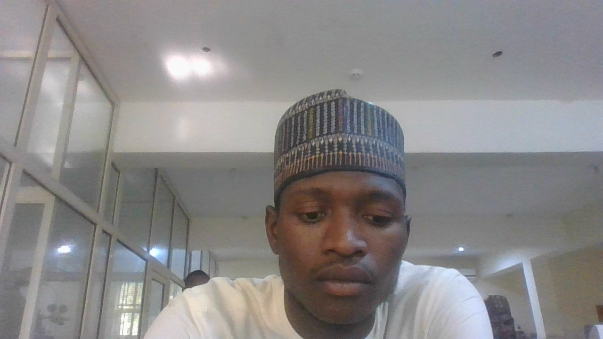

# About Me

{width=220px}

I am a final year medical student developing an interest in **bioinformatics, computational biology and data-driven approaches to medicine**.

My background in medicine and love for computers right before med school took over has made me interested in questions that sit at the intersection of biology, disease and computation.

## Why Bioinformatics?

First my fascination by just how much a computer can do plus my love for medicine.

My current focus is on building a strong foundation in:

- Python
- Linux
- Bash scripting
- Sequence analysis
- Data visualization

## My Approach

I am still very early in this journey, so this website is intentionally also a record of my learning process.

I want to document not only successful projects, but also the problems I encounter and how I solve them. And the ones that straight up defeated me, of course

---

**Last updated:** August 2026