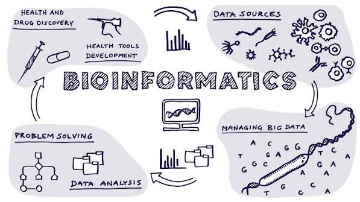

::: {.hero}

{.profile-photo}

# Muhammad Suraj Salihu

### Medical Student • Bioinformatics • Computational Biology

I am a medical student at **Bayero University Kano** developing skills in bioinformatics, computational biology, programming and data analysis.

I am interested in using computational approaches to investigate biological and clinical questions at the intersection of **medicine and computational research**.

[Explore My Projects](projects.qmd){.btn .btn-primary}
[View My GitHub](https://github.com/MuhdSuraj){.btn .btn-outline-secondary}
[Connect on LinkedIn](https://linkedin.com/in/muhammad-suraj-845b51184){.btn .btn-outline-secondary}

:::

---

## About Me

My academic journey began at **Al-Azhar Schools, Kano**, continued through **Musa Iliasu College, Kano**, and led me to **Bayero University Kano**, where I am pursuing an MBBS degree.

Alongside medicine, I am developing practical skills in **bioinformatics, Python, Linux, Bash, Git, data analysis and reproducible computational workflows**.

This website documents my projects, learning and development as I work toward combining **medicine, biology and computation**.

---

## Education

::: {.education-card}
### 🎓 Bayero University Kano
**MBBS — Medicine and Surgery**

Currently pursuing my medical degree while developing interests in bioinformatics and computational biology.
:::

::: {.education-card}
### 🏫 Musa Iliasu College, Kano
**Secondary Education**
:::

::: {.education-card}
### 📚 Al-Azhar Schools, Kano
**Primary Education**
:::

[View My Full Education Journey](education.qmd){.btn .btn-outline-primary}

---

## Research Interests

::: {.skill-card}
### 🧬 Genomics & Bioinformatics
Biological sequences, genomic data and computational approaches to biological questions.
:::

::: {.skill-card}
### 💻 Computational Biology
Using programming and computational methods to investigate biological systems.
:::

::: {.skill-card}
### 🧪 Biomedical Research
Research connecting molecular biology, disease and clinical medicine.
:::

::: {.skill-card}
### 🌍 Public Health
Exploring computational approaches to population-level health research.
:::

---

## Featured Project

### FLT3-Conserve

A bioinformatics project exploring sequence conservation across species using Python and biological sequence analysis, with a focus on the **FLT3 gene**.

**Status:** In progress

[View Project](projects.qmd){.btn .btn-primary}

---

## What I'm Learning

::: {.skill-card}
### 🐍 Python
Programming, data analysis and automation for biological applications.
:::

::: {.skill-card}
### 🐧 Linux & Bash
Command-line tools, shell scripting and computational workflows.
:::

::: {.skill-card}
### 📊 Data Analysis
Exploratory analysis, visualization and biological datasets.
:::

::: {.skill-card}
### 🧬 Bioinformatics
Sequence analysis, biological databases and computational workflows.
:::

::: {.skill-card}
### 🔗 Git & GitHub
Version control, project organization and reproducible research.
:::

::: {.skill-card}
### 📖 Quarto
Creating reproducible reports, documentation and research websites.
:::

---

## My Approach

> **Learn it. Build it. Document it. Share it.**

I believe learning becomes more meaningful when knowledge is put into practice.

This website is a record of my development as I learn to combine **medicine, biology and computation**.

---

## Acknowledgements

I am grateful to the **Centre for Biotechnology Research (CBR), Bayero University Kano**, and the tutors who have encouraged me to explore bioinformatics and develop my computational skills.

**Alhamdulillah for a beginning as fun as this.**

*30 August 2026*